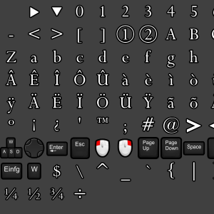

# FNT

## Summary
 </img> The Font file is responsible for defining the symbols that get presented to the screen for various languages. There can be multiple font files being used for different circumstances. 

The Font file works together with the [MDT](mdt.md) to create text dialogs for the player to interact with during gameplay, menus, and cutscenes.       

 ## Header
 </img> The header to a font file tells the game [where to find](#sprite-sheet-offset) the [sprite sheet](#sprite-sheet) and [spacing definitions](#spacing-definitions). The [sprite sheet](#sprite-sheet) and [spacing definitions](#spacing-definitions) work together to define how the characters get presented to the screen. On the PC version of the game, for latin based languages, there also appears to be extra data in the header that has an [unknown purpose](#unknown). ([suggest an edit](https://github.com/Zatarita/re4-wiki/issues/new?title=update-FNT-Unknown))      
 ## Sprite Sheet
 </img> The sprite sheet is a [texture](tpl.md) used by the game that holds the actual pixel data that makes up the font symbols. There are multiple sprite sheets used throughout the game for multiple languages. By spltiting up the sprite sheet this way languages that have thousands of symbols, such as Japanese or Chinese, can be narrowed down to only contain the symbols required for their inteded purpose.
    Some symbols don't represent a number or letter, but represent a button a player can press. These are called during quicktime events/ 'how to play' manuals. Some of these symbols span two cells of a sprite sheet. In this case the [font spacing](#font-spacing) is used to stitch the two cells together.
 ## Font Spacing
 </img> The font spacing determines the margins of the font lettering. There are two bytes that determine the [distance from the start](#left-margin) of the sprite sheet's cell, and the [length](#length) in pixels till the end of the symbol. These two pieces work together to 'cut' the symbol out of the sprite sheet. Typically these values add together to the full cell size. (which can vary from sprite sheet to sprite sheet) Though, the symbol can use less than the full cell periodically.
   Some font symbols span two cells. In this case the [length](#length) can be extended to include the two symbols as one.       
## Structure
### *Header*

| Field | Type | Legal Values | Default Value | Comment |
| :- | :- | :-: | :- | :- |
| Sprite Sheet Offset | uint32_t   |  |  | The offset that points to the start of the [TPL](tpl.md) that defines the font's sprite sheet. |
| Spacing Offset | uint32_t   |  |  | The offset that points to the start of the [font spacing definitions](#spacing-definitions). |
| Unknown | uint32_t  [6] |  |  | Unknown what these bytes do; however, they only seem to be set on the pc version of the game for the latin based symbols. |
| Sprite Sheet | [TPL](tpl.md)   |  |  | The sprite sheet holding the actual font symbols that gets presented to screen. |
| Spacing Defininitions | array : [Font Spacing](#font-spacing) [n] |  |  | The size of the array appears to be the [Spacing Offset](#spacing-offset) through the end of file. There also seems to be no bounds checking at runtime. |
### *Font Spacing*

| Field | Type | Legal Values | Default Value | Comment |
| :- | :- | :-: | :- | :- |
| Left Margin | byte   |  |  | Number of pixels between left border of the sprite and the beginning of the character. |
| Length | byte   |  |  | Number of pixels starting after the Left Margin going to the end of the symbol's cell. (with some variation) |
