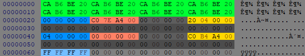

# Udas

The udas is the primary [container](https://en.wikipedia.org/wiki/Container_format_(computing)) used by the [pc port](main.md) of the game. It holds all the assets required for the game to function. Contained inside the udas are sub-files responsible for defining behaviour seen in a room. Utilizing some [tools](tools.md) we are able to access the content of these files and modify them. This is the primary workflow used for modding the game. 


# Structure
The file consists of a header and a body. The header acts a glossary that contains the metadata for all the data. Like a glossary in a book that has chapters and pages; the header contains the offsets and size of the data. This helps us navigate the body of the file. The header also contains the format of the sub-file. This lets us know how to interpret the data. Such as if the file is snd, dat, etc. Typically an UDAS consists of a [DAT](dat.md) file and a [SND](snd.md) file.<sup>[testing needed](https://github.com/Zatarita/re4-wiki/issues/new?title=update-UDAS_SubFile_Supported_Types)</sup>

Breaking down the structure of the file results in:

*Example r106.udas*<br>

```c
struct HeaderEntry
{
    enum FileType
    {
        END = 0xFFFFFFFF,   // -1
        DAT = 0x0,
        SND = 0x4,
    }

    FileType type;                  // Blue
    int      size;                  // Red
    int      unknown;               // Grey
    int      offset;                // Yellow
    int      unused[4];             // Grey
}

struct Header
{
    int         Magic[8];           // Green. Always 0xCAB6BE20 8 times
    HeaderEntry SubFileMetadata[];
    byte        padding[0x400];
}
```

When editing the file programatically there are a few things to keep in mind.
* The amount of subfiles in the container is dynamic. The header is read until a FileType of 0xFFFFFFFF is read from the stream. After that there is 0x400 bytes of padding. It is unknown if the padding is required here.<sup>[testing needed](https://github.com/Zatarita/re4-wiki/issues/new?title=update-UDAS_Padding_Requirement)</sup>
* All offsets in the file are aligned to the nearest 0x20 offset boundary. It is unknown if this is a requirement or optimization. <sup>[testing needed](https://github.com/Zatarita/re4-wiki/issues/new?title=update-UDAS_Alignment_Requirement)</sup>


