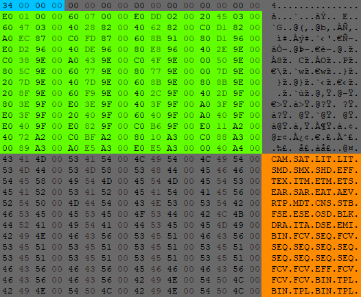

# Dat
The DAT File is the primary container format used to hold scene assets. Contained inside the DAT are sub-files responsible for defining behaviour seen in a room. These subfiles have many different uses ranging from models, to events. Utilizing some [tools](tools.md) we are able to access the content of these files and modify them. This is the primary workflow used for modding the game.

# Structure
The file consists of a header and a body. The header acts a glossary that contains the metadata for all the data. Like a glossary in a book that has chapters and pages; the header contains the offsets and size of the data. This helps us navigate the body of the file. The header also contains the format of the sub-file. This lets us know how to interpret the data. Such as if the file is animation, model, or level geometry.

# Subfiles
[AEV]() 
[BIN]() 
[BLK]() 
[CAM]() 
[CNS]() 
[DCT]() 
[DRA]() 
[DSE]() 
[EAR]() 
[EAT]() 
[EFF]() 
[EMI]() 
[ESE]() 
[ESL]() 
[ETM]() 
[ETS]() 
[EVD]() 
[FCS]() 
[FCV]() 
[FNT]() 
[ITA]() 
[ITM]() 
[LIT]() 
[MDT]() 
[OSD]() 
[RTP]() 
[SAR]() 
[SAT]() 
[SEQ]() 
[SFD]() 
[SHD]() 
[SMD]() 
[SMX]() 
[SND]() 
[STB]() 
[TEX]() 
[TPL]() 
[UWF]() 
[VIB]() 
[MHT]() 

{TODO:Verify udas sub-file list & fill out entries}